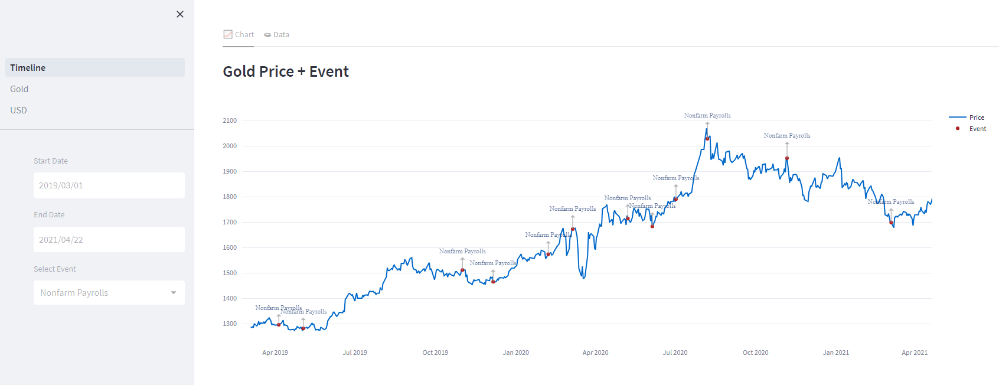

# Timeline

##### timeline modual in python

The main task of this module is to draw time series data along with historical information as a **timeline**.

You can display your own dataframes that contain the changes of a numerical variable next to different **historical events**

| Date | Time       | country  | Volatility    | Description              | Evaluation of the event                  | --                   | Actual event | Evaluation data | Event forecast |
| ---- | ---------- | -------- | ------------- | ------------------------ | ---------------------------------------- | -------------------- | ------------ | --------------- | -------------- |
| 44   | 2019-01-03 | 8:15:00  | United States | High Volatility Expected | ADP Nonfarm Employment Change ...        | Better Than Expected | K            | 271.000         | 179.000        |
| 108  | 2019-01-04 | 8:30:00  | United States | High Volatility Expected | Nonfarm Payrolls ...                     | Better Than Expected | K            | 312.000         | 178.000        |
| 479  | 2019-01-16 | 10:30:00 | United States | High Volatility Expected | Crude Oil Inventories ...                | Better Than Expected | M            | -2.683          | -1.323         |
| 519  | 2019-01-17 | 8:30:00  | United States | High Volatility Expected | Philadelphia Fed Manufacturing Index ... | Better Than Expected | NaN          | 17.000          | 9.700          |
| 857  | 2019-01-30 | 8:15:00  | United States | High Volatility Expected | ADP Nonfarm Employment Change ...        | Better Than Expected | K            | 213.000         | 180.000        |

Convert the above dataframe to the following **timeline**.

